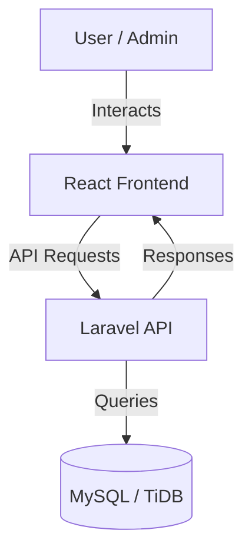

# QuickHire Job Portal

<div align="center">
  
  <p align="center">
    <strong>Connecting talent with opportunity through a premium, state-of-the-art job discovery platform.</strong>
  </p>
</div>

---

## 🚀 Overview

**QuickHire** is a full-stack job portal designed for high performance and premium user experience. It provides a seamless interface for job seekers to discover opportunities and for administrators to manage job listings and applications with ease.

Built with **React 19** on the frontend and **Laravel 12** on the backend, QuickHire leverages modern web standards to provide a responsive, fast, and interactive platform.

---

## ✨ Key Features

### 🔍 For Job Seekers
- **Dynamic Job Discovery**: Search and filter jobs by category, type (Full-time, Remote, etc.), and experience level.
- **Rich Job Details**: Comprehensive job descriptions with rich text support.
- **Instant Application**: Quick and easy application process with form validation.
- **Responsive Design**: Optimized for mobile, tablet, and desktop viewing.

### 🛠️ For Administrators
- **Admin Dashboard**: Centralized management of all job listings.
- **Listing Management**: Create, edit, and delete job listings in real-time.
- **Rich Text Editor**: Integrated Tiptap editor for crafting professional job descriptions.
- **Application Tracking**: View and manage candidate applications (Work in Progress).

---

## 🛠️ Tech Stack

### Frontend
- **Framework**: React 19 (Vite)
- **Styling**: Tailwind CSS 4
- **Animations**: Framer Motion
- **Form Handling**: React Hook Form + Zod (Validation)
- **Icons**: Lucide React
- **Rich Text**: Tiptap Editor
- **API Client**: Axios

### Backend
- **Framework**: Laravel 12 (PHP 8.2+)
- **API**: RESTful API with JSON Resources
- **Database**: MySQL / TiDB Cloud
- **State Management**: Eloquent ORM
- **Security**: Laravel Sanctum

---

## 🏗️ System Architecture



---

## 🚦 Getting Started

### Prerequisites
- **PHP** 8.2+
- **Composer**
- **Node.js** & **npm**
- **MySQL** or a **TiDB** account

### 📦 Backend Setup
1. Navigate to the backend directory:
   ```powershell
   cd backend
   ```
2. Install PHP dependencies:
   ```powershell
   composer install
   ```
3. Configure Environment:
   ```powershell
   copy .env.example .env
   ```
   *Update `.env` with your database credentials.*
4. Generate App Key:
   ```powershell
   php artisan key:generate
   ```
5. Run Migrations & Seeders:
   ```powershell
   php artisan migrate --seed
   ```
6. Start the server:
   ```powershell
   php artisan serve
   ```

### 💻 Frontend Setup
1. Navigate to the frontend directory:
   ```powershell
   cd frontend
   ```
2. Install dependencies:
   ```powershell
   npm install
   ```
3. Configure Environment:
   ```powershell
   copy .env.example .env.local
   ```
   *Ensure `VITE_API_URL` points to your backend (default: `http://localhost:8000/api`).*
4. Run the development server:
   ```powershell
   npm run dev
   ```

---

## 📖 API Documentation

The backend provides several RESTful endpoints:

| Endpoint | Method | Description |
| :--- | :--- | :--- |
| `/api/jobs` | `GET` | Retrieve all job listings |
| `/api/jobs` | `POST` | Create a new job listing (Admin) |
| `/api/jobs/{id}` | `GET` | Get details of a single job |
| `/api/jobs/{id}` | `DELETE` | Delete a job listing (Admin) |
| `/api/applications` | `POST` | Submit a job application |
| `/api/taxonomies` | `GET` | Get categories, job types, and levels |

---

## 📄 License

This project is open-sourced software licensed under the **MIT license**.
